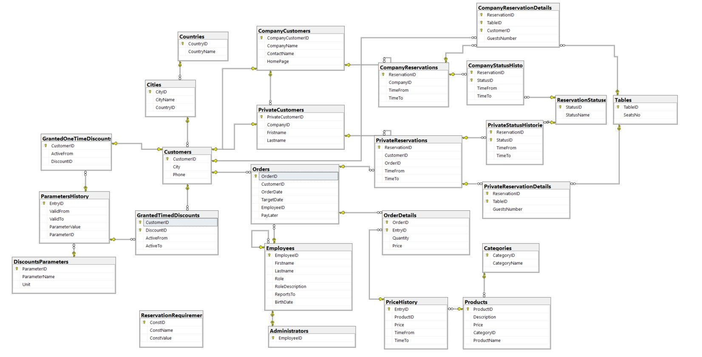
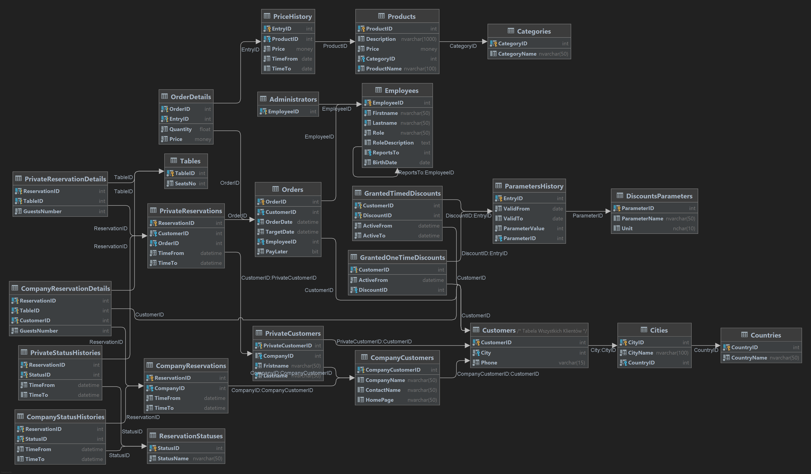

# Restaurant Database Project

### Description

This repository contains a restaurant database project for *Fundamentals of Databases* course teached on AGH UST.
Requirements for the database are contained in the `handout.pdf` file (written in Polish). Documentation required by te teacher (also in Polish) is contained in `raport.pdf` file.

### Authors:

The project was created by

- Wojciech Dróżdż - https://github.com/behenate
- Błażej Nowicki - https://github.com/BlazejNowicki
- Krzysztof Gwiazda - https://github.com/kgwiazdak

### Database schemas:

##### SSMS:

##### Datagrip:

Parts of the database might seem atypical, this has been caused by the teacher having **very** specific requirements of how things should work. We had to implement them their way even if our original ideas were *different* (better).
